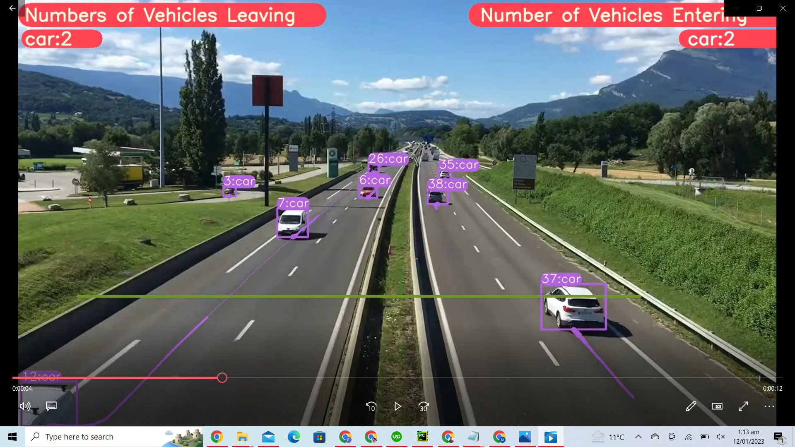

<H1 align="center">
YOLOv8 Object Detection with DeepSORT Tracking </H1>

## Colab File Link 
The google colab file link for yolov8 object detection and tracking is provided below, you can check the implementation in Google Colab, and its a single click implementation
,you just need to select the Run Time as GPU, and click on Run All.

[`Google Colab File`](https://colab.research.google.com/drive/1Ls1WW9AwtdEjkm_q6e-IG31xP5aBDQyH?usp=sharing)

## Steps to run Code

- Clone the repository
```
https://github.com/MuhammadMoinFaisal/YOLOv8-DeepSORT-Object-Tracking.git
```
- Goto the cloned folder.
```
cd YOLOv8-DeepSORT-Object-Tracking
```
- Install the requirements
```
pip install -r requirements.txt

```
- To use the YOLOv8 Command Line Interface, install the Ultralytics Package
```

pip install ultralytics

```
- To implement detection
```
yolo task=detect mode=predict model=yolov8n.pt source="https://ultralytics.com/images/bus.jpg

```
- For Segmentation
```

yolo task=segment mode=predict  source="https://ultralytics.com/images/bus.jpg"

```
- Setting the Directory.
```
cd YOLOv8-DeepSORT-Object-Tracking/yolo/v8/detect

```
- Downloading the DeepSORT Files From The Google Drive , unzip them and place them into the yolo/v8/detect folder
```
cd YOLOv8-DeepSORT-Object-Tracking

gdown "https://drive.google.com/uc?id=1BNZ1S5yflbQpbHeRM1fNeu_2WfuP17hJ&confirm=t"

unzip /content/yolov7-segmentation-with-DeepSORT-Tracking/deep_sort_pytorch.zip


```
- Downloading a Sample Video from the Google Drive
```
gdown "https://drive.google.com/uc?id=1rjBn8Fl1E_9d0EMVtL24S9aNQOJAveR5&confirm=t"
```

- Run the code with mentioned command below.

- For yolov8 object detection + Tracking
```
python3 tracking.py model=yolov8l.pt source="test1.mp4" show=True
```

### RESULTS

#### Vehicles Detection, Tracking and Counting 


#### Vehicles Detection, Tracking and Counting


