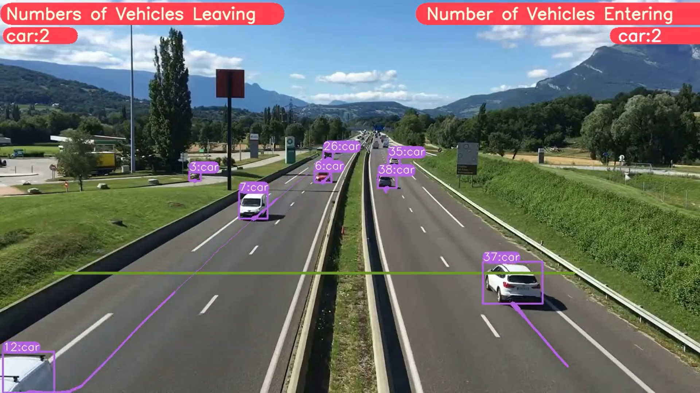
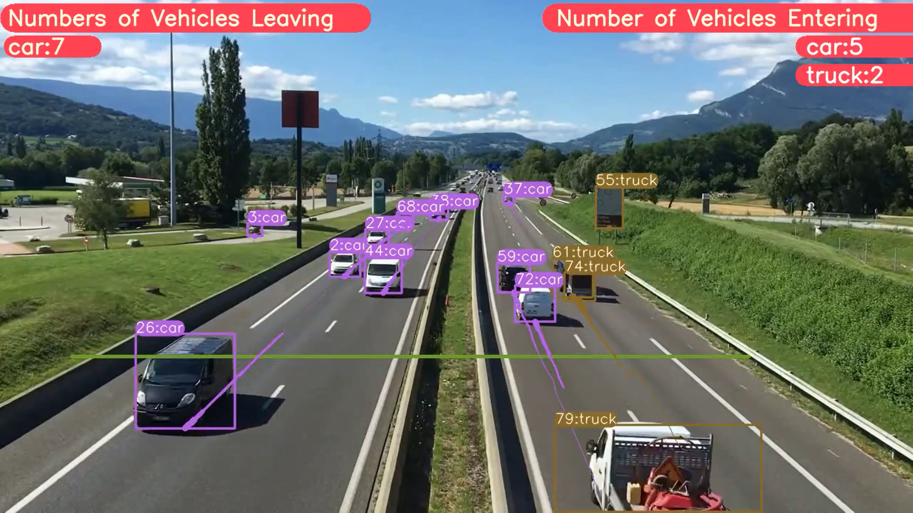

<H1 align="center">
YOLOv8 Object Detection with DeepSORT Tracking(ID + Trails) </H1>

## Google Colab File Link (A Single Click Solution)
The google colab file link for yolov8 object detection and tracking is provided below, you can check the implementation in Google Colab, and its a single click implementation, you just need to select the Run Time as GPU, and click on Run All.

[`Google Colab File`](https://colab.research.google.com/drive/1U6cnTQ0JwCg4kdHxYSl2NAhU4wK18oAu?usp=sharing)

## Object Detection and Tracking (ID + Trails)  using YOLOv8 on Custom Data
## Google Colab File Link (A Single Click Solution)
[`Google Colab File`](https://colab.research.google.com/drive/1dEpI2k3m1i0vbvB4bNqPRQUO0gSBTz25?usp=sharing)

## YOLOv8 Segmentation with DeepSORT Object Tracking

[`Github Repo Link`](https://github.com/MuhammadMoinFaisal/YOLOv8_Segmentation_DeepSORT_Object_Tracking.git)

## Steps to run Code

- Clone the repository
```
git clone https://github.com/MuhammadMoinFaisal/YOLOv8-DeepSORT-Object-Tracking.git
```
- Goto the cloned folder.
```
cd YOLOv8-DeepSORT-Object-Tracking
```
- Install the dependecies
```
pip install -e '.[dev]'

```

- Setting the Directory.
```
cd ultralytics/yolo/v8/detect

```
- Downloading the DeepSORT Files From The Google Drive 
```

https://drive.google.com/drive/folders/1kna8eWGrSfzaR6DtNJ8_GchGgPMv3VC8?usp=sharing
```
- After downloading the DeepSORT Zip file from the drive, unzip it go into the subfolders and place the deep_sort_pytorch folder into the yolo/v8/detect folder

- Downloading a Sample Video from the Google Drive
```
gdown "https://drive.google.com/uc?id=1rjBn8Fl1E_9d0EMVtL24S9aNQOJAveR5&confirm=t"
```

- Run the code with mentioned command below.

- For yolov8 object detection + Tracking
```
python predict.py model=yolov8l.pt source="test3.mp4" show=True
```
- For yolov8 object detection + Tracking + Vehicle Counting
- Download the updated predict.py file from the Google Drive and place it into ultralytics/yolo/v8/detect folder 
- Google Drive Link
```
https://drive.google.com/drive/folders/1awlzTGHBBAn_2pKCkLFADMd1EN_rJETW?usp=sharing
```
- For yolov8 object detection + Tracking + Vehicle Counting
```
python predict.py model=yolov8l.pt source="test3.mp4" show=True
```

### RESULTS

#### Vehicles Detection, Tracking and Counting 


#### Vehicles Detection, Tracking and Counting



### Watch the Complete Step by Step Explanation

- Video Tutorial Link  [`YouTube Link`](https://www.youtube.com/watch?v=9jRRZ-WL698)


[]([https://www.youtube.com/watch?v=StTqXEQ2l-Y](https://www.youtube.com/watch?v=9jRRZ-WL698))

